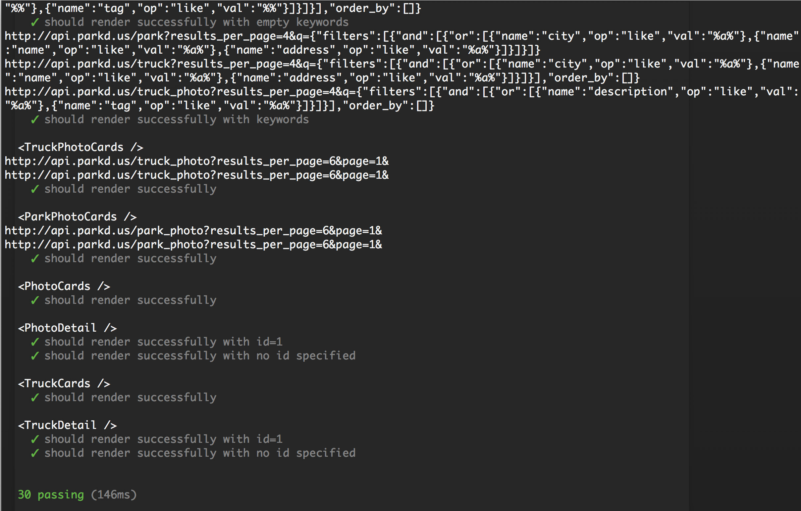
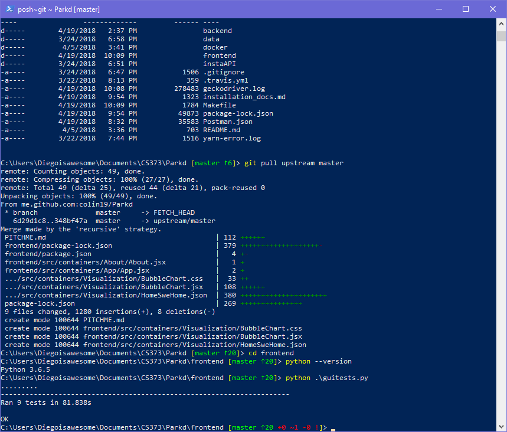
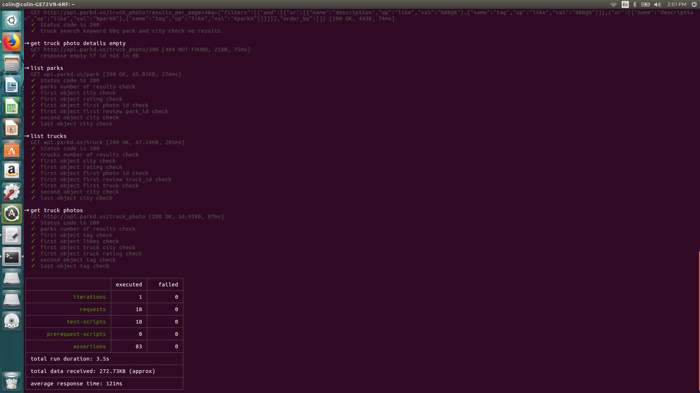

# Parkd.US

### Food trucks for the future!

---

## The Team
- Gijs Landwehr |
  + backend, data cleaning |
- Austen Castberg |
  + Hosting |
- Colin Hall |
  + Postman Testing, UML diagram |
- Javier Banda |
  + backend, scraping, documentation and tests |
- Diego Alcoz |
  + front-end and tests |
- Lin Guan |
  + front-end, filtering, and tests |

---

## [Our Website](http://Parkd.US)

+++

#### Backend Tests

+++

#### Mocha Tests

+++

#### Selenium Tests

+++

#### Postman Tests

---

## Self Critique

+++

## What did we do well?
- Website design |
- Overcoming adversity |
- Communicating and collaborating |
- Minimal Github Issues |

+++

## What did we learn?
- Various tools like React, Flask, MySQL, etc |
- How to collaborate effectively |
- Setting and reaching mini goals |

+++

## What can we do better?
- Add more data for more cities |
- There’s always more data to be refined |
- More tests! |

+++

## What puzzles us?
- Optimizing for mobile |
- Expanding database without manually adjusting bad data |
- Docker |

---

## Home SWE Home Critique

+++

##  What did they do well?
- Great concept |
- Top notch website aesthetic |
- real-world application |
- Lots of data |

+++

## What did we learn from their website?
- Better ways to capture Park data |
- Ideas about generating proximity of parks and for trucks |
- API endpoints and documentation |

+++

## What can they do better?
- Distinction between AND/OR filtering isn’t totally obvious to users|
- Expand to cities beyond Texas?|

+++

## What puzzles us about their website?
- It’s unclear how often their data is updated |
- Filtering for dogs of mixed breeds |

---

## [Visualization](https://parkd.us/visual)
